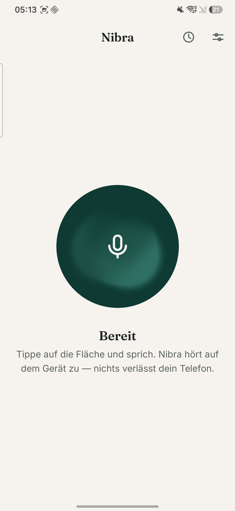
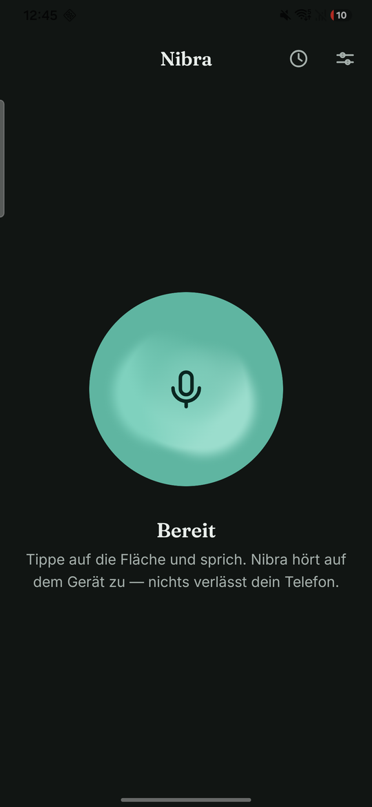

# Nibra

**Speak. Write. Done.**

Dictation app for Android. Record speech, turn it into text, insert it into
any input field — entirely on the device.

 

| Light | Dark |
|---|---|
|  |  |

**[Guide](docs/GUIDE.md)** — set up, dictate, build, measure.

## What it does

- Large recording surface with a calm level display, stops on silence
- Inserts into **any** app through the accessibility service
- Searchable local history, grouped by date
- Text snippets: your own replacements
- Dictation language switchable per entry
- Seven interface languages: de, en, fr, es, it, tr, pl
- Light and dark

## What it does not do

**No `INTERNET` permission.** No account, no cloud, no ads, no trackers, no
analytics. Dictations stay in a local database; recordings are discarded
after transcription unless you explicitly keep them.

This is not a promise but a build condition: `./gradlew pruefeNetzfreiheit`
reads the merged manifest of the shipping flavour and fails the build if it
finds `INTERNET` or `ACCESS_NETWORK_STATE` — and fails just the same if it
finds no manifest at all, because a check that looks in the wrong place would
otherwise report success.

## Technical

| | |
|---|---|
| Language | Kotlin, Jetpack Compose |
| Recognition | Android on-device (`SpeechRecognizer`) |
| minSdk / targetSdk | 26 / 36 (Android 16) |
| Package | `de.ithandwerkstuttgart.nibra` |
| Version | 2.1 (versionCode 12) |
| Permissions | `RECORD_AUDIO`, accessibility service |

Signing fingerprint (SHA-256):
`16:9B:99:08:12:AE:A2:63:10:85:CB:97:CD:8C:C4:B3:CF:33:77:99:1A:27:6B:81:65:BC:9B:24:77:7F:BE:11`

The signing key lives in the vault only (`NIBRA_UPLOAD_KEYSTORE_B64`,
`NIBRA_KEYSTORE_PROPERTIES_B64`) — never in the repository.

## Release

The Play bundle is produced by `./gradlew bundleOfflineRelease` and lands in
`app/build/outputs/bundle/offlineRelease/`. Build outputs do not belong in
the repository: `abgabe/` only collects them locally and must never be the
source of an upload — it still held 1.0 while 2.1 was current, and an old
bundle looks exactly like a new one.

`store/` holds the listing texts in seven languages, the feature graphic, the
privacy policy, the data-safety answers, and the click-by-click walkthrough
`store/UEBERGABE.md`.

## Origin

Rebuilt on the basis of
[writingmate/aidictation](https://github.com/writingmate/aidictation) (MIT).
The approach was taken over; the code was written anew. Attribution in
[FREMDSOFTWARE.md](FREMDSOFTWARE.md).

The MIT licence covers that code. It does not cover the other project's name,
logo or store presence — those were removed from this tree, and a build rule
with a counter-test keeps them out.

## Licence

Nibra is **not open source**. Copyright (c) 2026 Belkis Aslani, all rights
reserved — see [LICENSE](LICENSE).

Third-party software keeps its own terms, untouched by that:

| Component | Licence |
|---|---|
| 146 libraries (AndroidX, Kotlin, Dagger/Hilt, Okio) | Apache License 2.0 |
| Inter and Fraunces typefaces | SIL Open Font License 1.1 |
| Template `writingmate/aidictation` | MIT License |

The full texts ship with the app and are readable under **Third-party
software**; in the source they live in `app/src/main/res/raw/lizenzen.txt`.
[FREMDSOFTWARE.md](FREMDSOFTWARE.md) gives the overview.

Speech recognition is provided by Android and is not bundled.

`./gradlew pruefeLizenzen` reads the runtime classpath of the shipping
flavour and raises an alarm when a dependency carries unexpected terms or is
missing from `lizenzen.txt`. It is an early warning so that a changed licence
situation surfaces while it can still be changed — **not legal advice**, and
no substitute for it.

## Documentation

Reports and measurements live under [`docs/`](docs/README.md). They are
written in German: they are the record of what was measured, and translating
them would put the wording of the evidence at risk.
